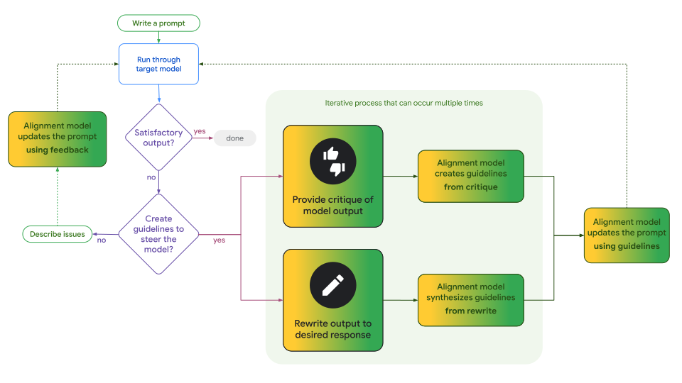

# Model Alignment

Model Alignment is a python library from the [PAIR](https://pair.withgoogle.com/)
team that enable users to create model prompts through user feedback instead of
manual prompt writing and editing. The technique makes use of constitutional
principles to align prompts to users' desired values.

The library ships with two different APIs:

-   Single-run Prompts: Interactively critique/kudos/rewrite responses to a
    prompt in order to create principles that are used to update a prompt.

-   Constitutional Experts: Use labeled training data to automatically create a
    prompt based on principles derived from the data.

## Installation

Install the model-alignment library through pip:

`pip install model-alignment`

## Use-Cases

### Single-Run Prompts

Check out our research paper [ConstitutionMaker: Interactively Critiquing Large
Language Models by Converting Feedback into
Principles](https://arxiv.org/abs/2310.15428) from [IUI
2024](https://iui.acm.org/2024/) for details on principle-based prompt alignment
through interactive feedback.

A simplified workflow of aligning single-run prompts can be seen in the image
below:



#### Demo Notebook

A demo Colab notebook for single-run interactive prompt alignment can be found
at
https://colab.research.google.com/github/pair-code/model-alignment/blob/main/notebooks/Single_Run_Prompt_API_for_Model_Alignment.ipynb.

A separate demo Colab notebook that makes use of the open-weights Gemma model
can be found at
https://colab.research.google.com/github/pair-code/model-alignment/blob/main/notebooks/Gemma_for_Model_Alignment.ipynb.

#### API Details

The main class to support single-run prompt alignment can be found in the
`AlignableSingleRun` class. The data for a given single-run prompt, including
its principles, is stored by this python class in the `ConstitutionalPrompt`
object.

`AlignableSingleRun` must be provided an instance of a `ModelHelper` in its
constructor. The `ModelHelper` wraps the LLM that will be used to both provide a
response given the prompt and also to create principles from user feedback. We
provide an implementation of `ModelHelper` for using [Gemini
models](https://ai.google.dev/api/python/google/generativeai) through Google's
Developer API and one for using the open-weights
[Gemma models](https://www.kaggle.com/models/google/gemma-2) running locally.
If desired, separate `ModelHelper` instances can be provided in the constructor
with the first instance used for the running of the prompt and the second used
for the model calls to perform alignment of the prompt.

##### Prompt Construction and Model Response.

Single-run prompts consist of three parts:

1.  A prompt preamble provided by the client, referred to as a
    `model_description`. Prompts can include variables that can be set when the
    prompt is run by wrapping the variables in curly brackets.
2.  A set of constitutional principles that are automatically added after the
    preamble.
3.  A user input for the specific request to the model.

For example, you could create a single-run prompt for providing creative uses
for an item by setting the model description to "Give three uses for the
following item: {item}".
Note that any variables in a prompt must be wrapped in curly brackets.

```python
single_run_prompt = single_run.AlignableSingleRun(model_helper.PalmModelHelper(palm_api_key))
single_run_prompt.set_model_description("Give three uses for the following item: {item}")
```

Then you can call the model through the `send_input` method which takes in a
dictionary with the mapping of any variables in the prompt to the values they
should use. If the prompt does not contain any variables, then no inputs are
necessary to the `send_input` method.

```python
response = single_run_prompt.send_input({"item": "scissors"})
print(response)
```

##### Generating Principles From Feedback and Applying Them.

After getting a model response through the `send_input` method, you can provide
feedback for the prompt with that input through one of three methods. The result
of any of these methods is that the principles list stored by the single-run
prompt object will be updated based on the feedback, and the updated principle
list will be returned:

1.  `critique_response` where you provide a reason why the response could use
    improvement.
2.  `kudos_response` where you provide a reason why the response was a good
    response.
3.  `rewrite_response` where you provide your own version of the model response
    that better aligns with what you wanted the model to return.

In all of these cases, the principles stored by the prompt will be updated in
one of three ways:

1.  A principle may be added to capture the feedback.
2.  An existing principle may be deleted if the feedback contradicts an existing
    principle.
3.  A principle may be updated if the feedback is related to an existing
    principle.

Once you have a set of principles you wish to apply to the prompt, the method
`update_model_description_from_principles` will update the stored prompt based
on the principles and return the newly-updated prompt.

Future calls to `send_input` will make use of the updated prompt.

```python
response = single_run_prompt.send_input("scissors")
# Response contains "1. Cut paper.\n2. Cut cloth.\n3. Cut hair."

single_run_prompt.critique_response("the list doesn't include any creative uses")
# The returned principles list now includes the principle "Include at least one creative use for the item"

single_run_prompt.update_model_description_from_principles()
# The prompt is now updated based on the new principle and the updated prompt is returned.

new_response = single_run_prompt.send_input("scissors")
# The new response contains "1. Cut paper.\n2. Cut cloth.\n3. Make paper snowflakes."
```

##### Automatically Creating Feedback

After calling `send_input`, there are two methods you can call to get
auto-generated feedback that can be provided to the `critique_response` and
`kudos_response` methods described above. This can help you ideate the types of
feedback you may wish to provide for generating principles.

These methods are `generate_critiques` and `generate_kudos` and each will return
a list of proposed feedback statements.

```python
response = single_run_prompt.send_input("scissors")
# Response contains "1. Cut paper.\n2. Cut cloth.\n3. Cut hair."

single_run_prompt.generate_critiques()
# The returned critiques list is ["The first item is too general.", "The items are missing supporting details.", "The first and second items are too similar."]
```

##### Direct Access to the Underlying Prompt Info

The `data` property of the `AlignableSingleRun` object contains the
`ConstitutionalPrompt` object that stores the model description, list of
principles, and the list of inputs and their corresponding outputs from using
this prompt.

##### Updating Prompts Directly From Feedback

This library also provides an alternative approach to updating prompts from
user-provided feedback. Instead of turning feedback into constitutional
principles, and then updating prompts from a list of principles, prompts can be
updated directly based on feedback without going through the intermediate step
of constitutional principle creation.

This approach is more efficient in that it only requires a single model call
for each piece of feedback, as opposed to two calls (one to turn feedback into a
principle and then another to update the prompt based on the principles). But,
this approach doesn't provide an explicit list of principles. Such a list can be
helpful for understanding the goals of a prompt and also for sharing principles
between prompts.

For this approach, call `update_model_description_from_feedback` with
feedback based on a use of the prompt. The prompt will be automatically updated
and returned by this method call.

```python
response = single_run_prompt.send_input("scissors")
# Response contains "1. Cut paper.\n2. Cut cloth.\n3. Cut hair."

single_run_prompt.update_model_description_from_feedback("the list doesn't include any creative uses")
# The returned updated prompt may be something like ""Give three uses for the following item, including at least one creative use: {item}"
```

### Constitutional Experts

We provide a library for training / evolving natural language classification
prompts. The evolution protocol is modeled off standard neural network training
concepts:

-   Weights / parameters: the natural language prompt (the final artifact from a
    training run)
-   Gradient descent: diagnose the issue with the current version of the prompt
    (e.g. the prompt uses overly formal language), and edit the prompt in the
    opposite direction (e.g. edit the prompt to use less formal language)
-   Optimization objective: to find a natural language prompt that generates
    accurate labels given a labeled dataset

Check out our research paper [ConstitutionalExperts: Training a Mixture of
Principle-based Prompts](https://arxiv.org/abs/2403.04894) from [ACL
2024](https://2024.aclweb.org/) for more information including detailed
evaluations.

#### Demo Notebook

A demo Colab notebook for single-run interactive prompt alignment can be found
at
https://colab.research.google.com/github/pair-code/model-alignment/blob/main/notebooks/Labeler_API_for_Model_Alignment.ipynb.

#### API Details

The main class for building a labeler can be found in the `Labeler` class. To
initialize a labeler, the user provides a few parameters that describe the
labeling task:

```python
labeler_maker = labeler.Labeler(input_names=['comment'], # The input features on which classification is based.
                       label_name='isHate', # The feature to be predicted.
                       label_values = [True, False],
                       task_description='Does the example contain offensive text?',
                       train_model_helper=model_helper.GeminiModelHelper(api_key, model_name='gemini-pro'),
                       eval_model_helper=model_helper.GeminiModelHelper(api_key, model_name=='gemini-pro'))
```

As part of initialization the user also defines a `train_model_helper` (the
model to be used in training) and `eval_model_helper` (the model to be used for
evaluation). We recommend using a larger model for training.

We provide a high-level API that lets users train classification prompts in a
hands-off fashion:

```python
toxicity_labeler = labeler_maker.initialize_checkpoint(train_df)

for i in range(NUM_TRAIN_STEPS):
  toxicity_labeler = labeler_maker.train_step(toxicity_labeler, train_df)
  predictions = labeler_maker.infer_checkpoint(toxicity_labeler, test_df)
  scorecard = labeler_maker.get_scorecard(test_df, predictions)
  print(f"Accuracy: {scorecard['accuracy']}")
```

The user only needs to provide a training (`train_df`) and evaluation
(`test_df`) set.

The final artifact produced at the end of training is a natural language prompt,
formulated in a "constitutional" style (the classification objective is
formulated in terms of principles). For example, the following is a sample
constitutional prompt trained on a toxicity classification objective:

```python
labeler.print_checkpoint(toxicity_labeler)
```

==================== Attributes for: False ====================

93931: Comment does not contain negative or hateful language towards a person or
group.

==================== Attributes for: True ====================

62194: Comment contains content that expresses hate or discrimination towards a
marginalized group.

This prompt can be used on unlabeled examples like so:

```python
new_examples = pd.DataFrame({'comment': ['I hate all people', 'I love my sister']})
predictions = labeler_maker.infer_checkpoint(toxicity_labeler, new_examples)

# Review predictions
for index, item in enumerate(zip(new_examples.iterrows(), predictions)):
  i, example = item[0]
  print(f"Example {index}")
  features = example[INPUTS].to_dict()
  for feature in INPUTS:
    print(f'{feature}: {features[feature]}')
  print("Prediction:", item[1]['prediction'])
```

#### Training hyperparameters

Labeler performance can be greatly impacted by the choice of hyperparameters. By
default, we initialize with the following hyperparameters:

```python
DEFAULT_HPARAMS: TrainingHyperparameters = {
    'n_incorrect_predictions_to_sample': 3,
    'n_mutations_to_try': 2,
    'n_best': 3,
    'score_fn': 'accuracy',
    'n_validation_examples': 100,
    'truncation_length': 100,
}
```

Hyperparameters are documented in `labeler_types.py`. In general, increasing the
hyperparameter values will improve the accuracy of the prompt, but will increase
training time.